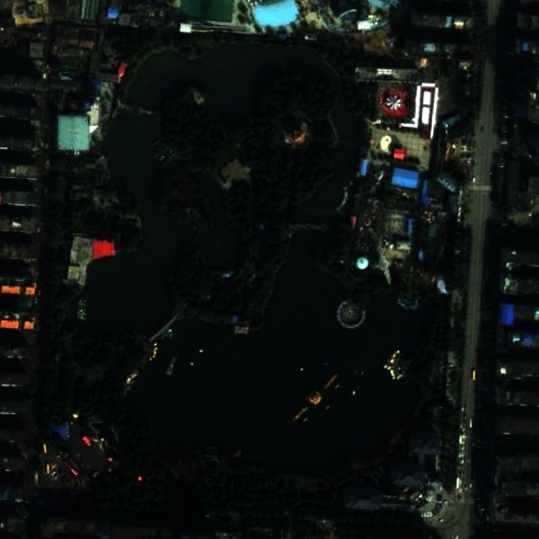
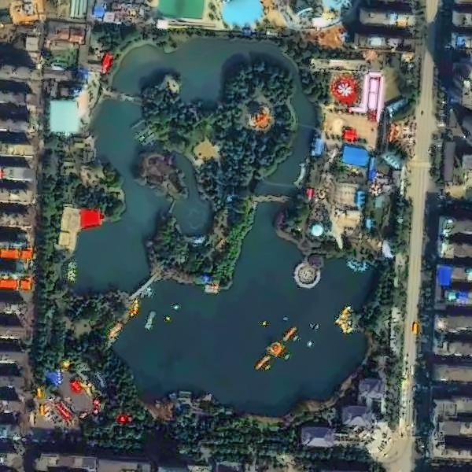
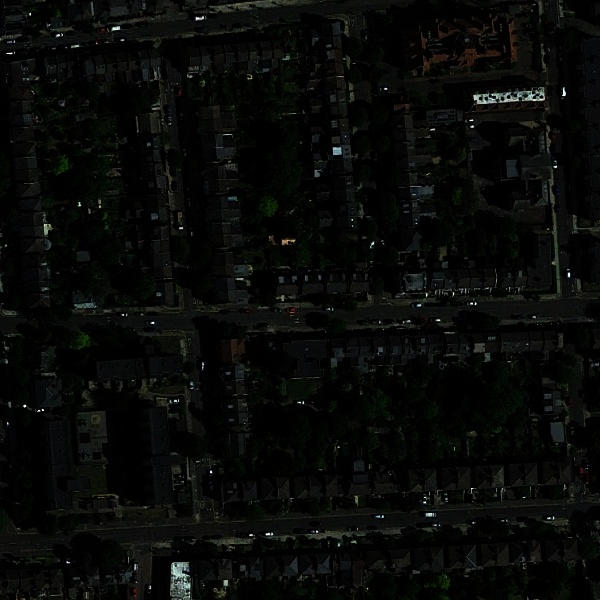
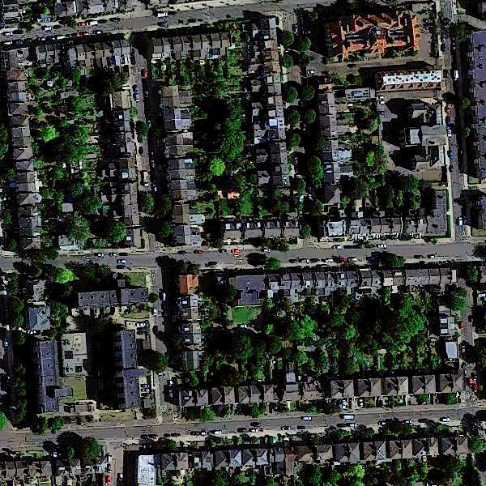

# 🌌 Satellite Dark Image Enhancement Pipeline (BTP)

A **classical computer vision pipeline** for enhancing **extremely low-light satellite and aerial images**, designed to recover visibility, preserve structural details, and produce perceptually natural outputs.

Unlike deep learning approaches, this project focuses on a **fully interpretable, non-ML pipeline** based on illumination modeling, multi-scale fusion, and Retinex theory.

---

## 🚀 Key Highlights

* 🌙 Enhances **extremely dark satellite imagery**
* 🧠 Fully **classical (non-deep learning)** approach
* 🔬 Multi-illumination modeling (4 derived instances)
* 🎯 Strong **edge and structure preservation**
* 🧩 Modular pipeline (easy to experiment with each stage)
* 📊 Designed for both **research and practical applications**

---

## 📌 About This Work

This project is **based on and inspired by the research paper**:

📄 *“Saliency and Contrast Mapping Based Dark Image Enhancement Using Multiple Illuminance Instance”*
by **Neha Singh and Ashish Kumar Bhandari**


---

### ⚠️ Important Clarification

* This is **NOT a direct copy** of the paper
* The original method has been **modified and extended**
* The implementation has been:

  * redesigned in Python (OpenCV + NumPy)
  * tuned specifically for **satellite imagery**
  * improved for **extreme low-light conditions**
  * extended with preprocessing and postprocessing steps

---

## 🔍 Key Modifications Over Original Paper

Compared to the original method, this project introduces:

* Adaptation for **satellite/aerial images** (not general scenes)
* Improved handling of:

  * extremely dark regions
  * weak edges
  * large uniform areas
* Additional preprocessing:

  * gray-world white balance
  * luminance blending
* Improved post-processing:

  * noise reduction
  * sharpening control
* Better parameter tuning for real-world datasets

---

## 🧠 Core Idea

> Instead of enhancing the image once, generate multiple illumination interpretations and fuse them using perceptual weights.

---

## 🧪 Pipeline Overview

```
Input Image
    ↓
Preprocessing
    ↓
Initial Illumination (Max Channel)
    ↓
4 Illumination Instances (I1, I2, I3, I4)
    ↓
Weight Maps (Luminance + Contrast + Saliency)
    ↓
Multi-scale Fusion
    ↓
Gamma Correction + CLAHE
    ↓
Retinex Reconstruction
    ↓
Post-processing
    ↓
Final Enhanced Image
```

---

## 🔬 Theoretical Foundation

The pipeline is based on **Retinex theory**:

$$
S = R \times I
$$

Where:

* **S** → input image
* **R** → reflectance (true scene details)
* **I** → illumination

The goal is to estimate and enhance **illumination**, then reconstruct the image.

---

## 🔍 Detailed Pipeline Breakdown

### 1. Preprocessing

* Normalize image to [0,1]
* Apply gray-world white balance
* Extract luminance

---

### 2. Initial Illumination Map

$$
I_c(x,y) = \max(R, G, B)
$$

* Captures brightness per pixel
* Forms base illumination

---

### 3. Illumination Instances

Four derived illumination maps:

---

#### 🔹 I1 — WLS Smoothing

* Edge-preserving smoothing
* Maintains structural boundaries

---

#### 🔹 I2 — Bilateral Filtering

* Smooth + edge preservation
* Maintains local contrast

---

#### 🔹 I3 — Arctangent Enhancement

$$
I_3 = \frac{2}{\pi} \tan^{-1}(\psi \cdot I_c)
$$

* Boosts dark regions aggressively

---

#### 🔹 I4 — Multi-scale Gaussian

* Smooths texture noise
* Produces stable illumination

---

### 4. Weight Maps

Each instance is weighted using:

* **Luminance Weight (WL)** → brightness
* **Contrast Weight (Wc)** → edges
* **Saliency Weight (Ws)** → important regions

Final weight:

$$
W = WL \times Wc \times Ws
$$

---

### 5. Multi-scale Fusion

* Gaussian pyramids → weights
* Laplacian pyramids → images

$$
F = \sum (W_i \cdot I_i)
$$

---

### 6. Illumination Adjustment

* Gamma correction (α ≈ 0.3)
* CLAHE

---

### 7. Retinex Reconstruction

$$
R = \frac{S}{I}, \quad Output = R \cdot I_{enhanced}
$$

---

### 8. Post-processing

* Denoising
* Sharpening
* Color correction

---

## 🖼️ Visual Results
### Example 1
| Original                            | Enhanced                           |
| ----------------------------------- | ---------------------------------- |
|  |  |

### Example 2
| Original | Enhanced |
|----------|----------|
|  |  |

---

## 📁 Project Structure

```bash
btp_satellite_enhancement/
├── src/
│   ├── pipeline.py
│   ├── main.py
│   ├── retinex.py
│   ├── tone.py
│   ├── utils.py
│   ├── illumination.py
│   ├── weights.py
│   ├── pyramids.py
│   ├── preprocess.py
│   ├── postprocess.py
│
├── data/
│   ├── input/
│   ├── results/
│
├── requirements.txt
└── README.md
```

## 📂 Dataset Used

This project uses the:

**AID-Night: Low-Light Satellite Image Dataset (Kaggle)**

🔗 https://www.kaggle.com/datasets/kannanwisen/aid-night-low-light-satellite-image-dataset

---

### 📚 Citation

> Kannan Wisen. (2025). *AID-Night: A Synthetic Benchmark Dataset for Low-Light Aerial Image Enhancement*. Kaggle Repository.

Base dataset:

> Xia et al. (2017). *AID: A benchmark dataset for aerial scene classification*. IEEE TGRS.

---

## ⚙️ How to Run

### Install dependencies

```bash
pip install -r requirements.txt
```

---

### Run on image

```bash
python src/main.py --input data/input/image.png --output data/results/result.png
```

---

### Run on dataset

```bash
python src/main.py --input ./data/input --output ./data/results
```

---

## 📊 Evaluation

Evaluated using:

* Entropy
* Edge preservation
* Visual comparison

---

---

## ⏱️ Runtime Performance

The enhancement pipeline is computationally intensive due to multiple stages such as:

* edge-preserving filtering (WLS, bilateral)
* multi-scale Gaussian processing
* Laplacian pyramid fusion

On a standard system (CPU-based execution), the **average processing time is:**

> 🕒 **~5 to 6 seconds per image**

---

### ⚙️ Notes

* Time may vary depending on:

  * image resolution
  * hardware configuration
* Higher resolution images will take longer due to:

  * multi-scale pyramid operations
  * filtering complexity

---

### 🚀 Optimization Scope

The current implementation prioritizes **quality over speed**.
Future improvements may include:

* GPU acceleration
* parallel processing
* optimized filtering techniques

---

### 🧠 Insight

> The runtime cost is a trade-off for achieving **high-quality enhancement with strong edge and detail preservation**.

---


## ⚠️ Limitations

### 1. Low-Texture / Edge-less Regions

* Example: deserts, oceans, large empty land
* Enhancement may look **flat or unnatural**

---

### 2. Extremely Dark Images

* Near-zero information → noise amplification

---

### 3. Parameter Sensitivity

* Requires tuning for best results

---

### 4. Computational Cost

* Multi-scale fusion is relatively slow

---

### 🧠 Key Insight

> The pipeline enhances existing information —
> it cannot recover details that were never captured.

---

## 👨‍💻 Author

**Aryankumar Panchasara**
B.Tech ICT (Information and Communication Technology)
Dhirubhai Ambani University (Formerly DA-IICT)

---

## 🙏 Acknowledgment

Special thanks to:

* Neha Singh
* Ashish Kumar Bhandari

for their foundational research work, which inspired this implementation.

---

## ⭐ Final Note

This project demonstrates that **well-designed classical methods can still compete strongly**, especially in extreme conditions where deep learning may struggle.

---

🚀 *From darkness → to clarity.*
